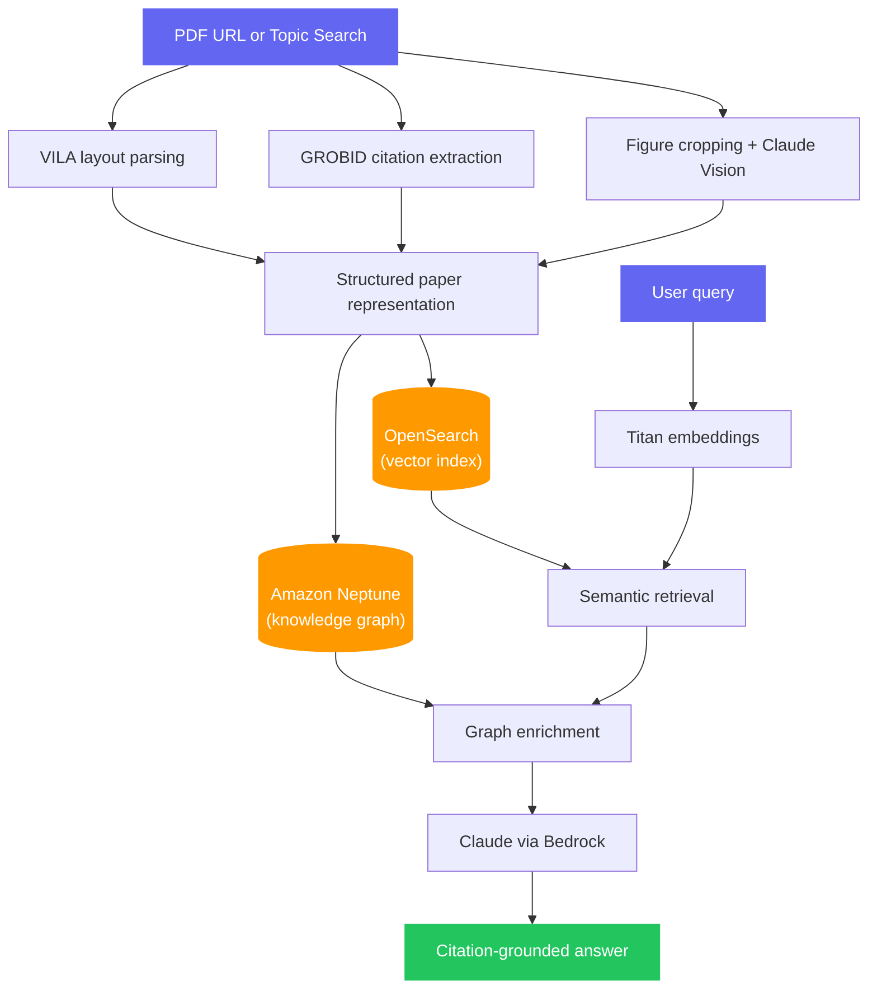
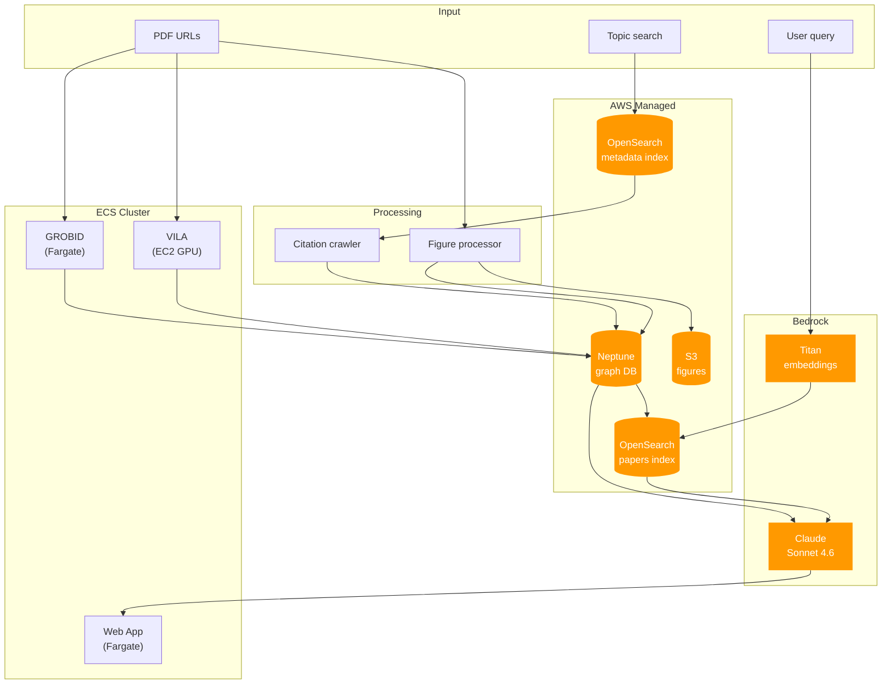
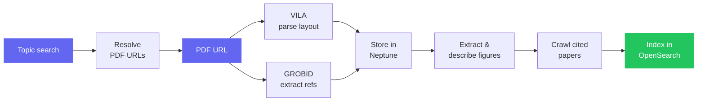

<div align="center">

# Rapid2

**Graph-powered RAG for scientific papers**

Citation chaining &middot; Figure understanding &middot; Paper discovery &middot; Web interface

[](https://python.org)
[](#)
[](LICENSE)
[](#architecture)
[](#deployment)

<br />

Rapid2 ingests academic PDFs, preserves their structure in a knowledge graph,<br />
links citations, extracts and describes figures with vision AI,<br />
and answers questions with full citation provenance.

[Getting Started](#getting-started) &middot; [Architecture](#architecture) &middot; [Web UI](#web-ui) &middot; [Deployment](#deployment) &middot; [API Reference](#api-reference)

</div>

---

## Why Rapid2?

Most paper-QA pipelines flatten PDFs into generic chunks. Rapid2 keeps the structure that makes research papers useful:

- **Section-aware parsing** &mdash; knows that Section 2.1 lives inside Section 2
- **Citation-aware retrieval** &mdash; tracks which blocks cite which references, and follows the chain
- **Figure understanding** &mdash; extracts images, sends them to Claude for visual descriptions
- **Cross-paper expansion** &mdash; crawls cited papers and pulls in relevant sections automatically
- **Graph + vector retrieval** &mdash; combines structural reasoning with semantic search
- **Web UI + CLI + API** &mdash; multiple interfaces for ingestion and querying

---

## End-to-End Flow



---

## Core Capabilities

### 1. Structured PDF Understanding

VILA classifies document regions &mdash; title, abstract, sections, paragraphs, figures, tables, footnotes &mdash; preserving layout hierarchy and bounding boxes instead of treating the paper as raw text.

### 2. Citation Graph Construction

GROBID extracts bibliography metadata and maps in-text references like "[Smith et al.]" to their full entries. These are stored as graph edges so the system knows which blocks cite which papers.

### 3. Citation Crawling

After ingesting a paper, Rapid2 automatically resolves cited papers via Semantic Scholar, downloads their PDFs, extracts relevant sections, and adds them to the graph for deeper context.

### 4. Figure Understanding

Figures and tables are cropped from PDF pages using bounding boxes, uploaded to S3, and described by Claude Vision. The descriptions become searchable graph nodes, so the RAG pipeline can reason about charts and diagrams.

### 5. Hybrid Retrieval

Content is embedded with Titan and indexed in OpenSearch for semantic search. Retrieved blocks are then enriched with graph context from Neptune &mdash; section hierarchy, citations, figure descriptions &mdash; before answer generation.

### 6. Paper Discovery

Search ~50-80M scientific paper records from Anna's Archive metadata (Sci-Hub, LibGen scientific, Crossref) indexed in OpenSearch. Find papers by topic, resolve download URLs, and batch-ingest them.

---

## Architecture



All infrastructure is defined in OpenTofu and deploys with a single command.

---

## Ingestion Pipeline



---

## Query Pipeline


---

## Getting Started

### Prerequisites

- Python 3.10+
- AWS account with Bedrock model access (Claude Sonnet 4.6 + Titan Embed v1)
- [OpenTofu](https://opentofu.org/docs/intro/install/) >= 1.6 (for full deployment)
- Docker

### Local Development

```bash
git clone https://github.com/killmlana/Rapid2.git
cd Rapid2

python -m venv .venv
source .venv/bin/activate
pip install -r requirements.txt

cp .env.example .env
# Edit .env with your AWS endpoints

pytest tests/ -v

uvicorn web.app:app --reload --port 8000
```

### Quick Start

```bash
# Process a paper
python main.py --url https://arxiv.org/pdf/2106.00676.pdf

# Query it
python main.py --query "What are the main contributions of this paper?"

# Search by topic and batch-ingest
python main.py --search "vision transformers for document understanding" --max 5

# Skip citation crawling for faster processing
python main.py --url https://arxiv.org/pdf/2106.00676.pdf --no-crawl
```

---

## Web UI

The web interface has three panels:

**Ask** &mdash; Query your knowledge base. Type a question, get a citation-backed answer with references to the papers you've ingested.

**Discover** &mdash; Search Anna's Archive for scientific papers by topic. Filter by year range. Ingest individual papers or the entire batch.

**Ingest** &mdash; Paste PDF URLs directly. Watch the pipeline process them in real time with live progress tracking.

---

## Deployment

### Full AWS Deployment

```bash
./scripts/deploy.sh dev
# ~25-30 minutes for first deploy
# Outputs the ALB URL when done
```

### What Gets Created

| Resource | Purpose | Spec |
|----------|---------|------|
| VPC | Networking | 2 AZs, public + private subnets, NAT |
| Neptune | Knowledge graph | db.t3.medium |
| OpenSearch | Vector search (papers) | r6g.large, 100GB |
| OpenSearch | Paper discovery (Anna's) | r6g.large, 150GB |
| ECS Fargate | GROBID service | 2 vCPU / 4GB |
| ECS EC2 GPU | VILA service | g4dn.xlarge |
| ECS Fargate | Web app | 1 vCPU / 2GB |
| ALB | Public HTTP access | &mdash; |
| S3 | Figure storage | Encrypted, versioned |
| ECR | Container registries | 3 repos |

```bash
# Tear down when done
cd infra/tofu && tofu destroy -var-file=dev.tfvars
```

### Ingest Anna's Archive Metadata

To enable topic-based paper discovery:

```bash
# Ingest scientific dumps (Sci-Hub, LibGen, Crossref)
python scripts/ingest_annas_metadata.py /path/to/annas_dumps/

# Or a single file (.jsonl, .jsonl.gz, .jsonl.zst)
python scripts/ingest_annas_metadata.py annas_archive_meta__aac_scihub__2024.jsonl.zst
```

The script auto-selects scientific sources, filters to PDFs with titles/DOIs, and streams with batch indexing.

---

## API Reference

### `POST /api/query`

Query the knowledge base.

```json
{ "query": "What attention mechanisms are used?" }
```

### `POST /api/search`

Search Anna's Archive for papers.

```json
{
  "topic": "graph neural networks",
  "max_papers": 10,
  "year_from": 2020,
  "year_to": 2024
}
```

### `POST /api/ingest`

Process PDF URLs. Returns a `job_id` for progress tracking.

```json
{
  "urls": ["https://arxiv.org/pdf/2106.00676.pdf"],
  "crawl_citations": true
}
```

### `POST /api/search-and-ingest`

Search and immediately ingest results. Same parameters as `/api/search`.

### `GET /api/jobs/{job_id}`

Poll ingest job progress, completed URLs, and failures.

### `GET /api/health`

Returns `{"status": "ok"}`.

---

## Project Structure

```
rapid2/
├── main.py                          # CLI entrypoint
├── grobid_client.py                 # GROBID citation extraction client
├── vila_parser.py                   # VILA layout analysis client
├── config/
│   └── settings.py                  # Environment-based configuration
├── processors/
│   ├── neptune_client.py            # Neptune graph operations
│   ├── opensearch_client.py         # Vector search + RAG pipeline
│   ├── bedrock_embedder.py          # Titan embedding utilities
│   ├── citation_crawler.py          # Semantic Scholar citation chaining
│   ├── image_processor.py           # Figure extraction + Claude Vision
│   ├── annas_client.py              # Anna's Archive metadata search
│   └── pdf_processor.py             # VILA CSV to document structure
├── web/
│   ├── app.py                       # FastAPI backend
│   └── static/                      # Frontend assets
├── scripts/
│   ├── deploy.sh                    # One-command AWS deployment
│   └── ingest_annas_metadata.py     # Metadata bulk loader
├── infra/
│   ├── tofu/                        # OpenTofu infrastructure-as-code
│   └── docker/                      # Dockerfiles (grobid, vila, web)
├── tests/                           # 48 tests
├── vila/                            # VILA model (vendored)
├── requirements.txt
└── .env.example
```

---

## Tech Stack

| Layer | Technology |
|-------|-----------|
| Layout Analysis | [VILA](https://github.com/allenai/vila) (LayoutLM, HuggingFace) |
| Citation Parsing | [GROBID](https://github.com/kermitt2/grobid) |
| Knowledge Graph | Amazon Neptune (openCypher) |
| Vector Search | Amazon OpenSearch |
| Embeddings | Amazon Titan Embed Text v1 |
| LLM + Vision | Claude Sonnet 4.6 via Bedrock |
| Paper Discovery | Anna's Archive metadata |
| Paper Resolution | Semantic Scholar API |
| Infrastructure | OpenTofu |
| Containers | ECS (Fargate + EC2 GPU) |
| Web | FastAPI + vanilla JS |

---

## Design Goals

- Preserve paper structure instead of flattening it
- Make citations first-class retrieval objects
- Combine graph reasoning with vector retrieval
- Support multi-paper expansion through references
- Work from CLI, API, and browser

---

## License

MIT
